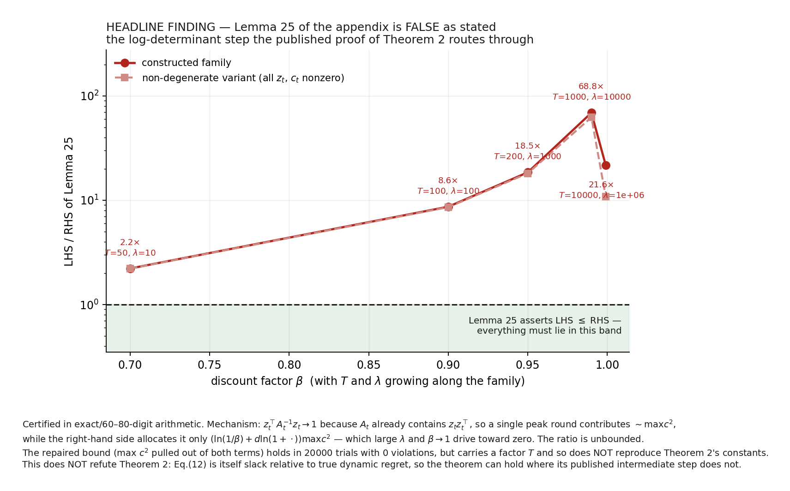
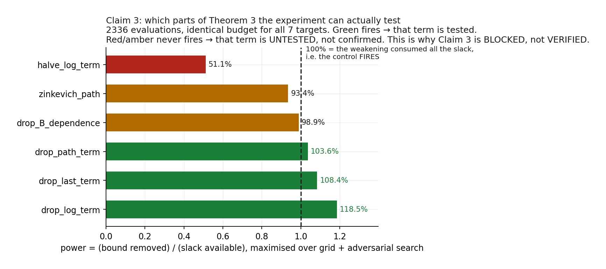

# Reproduction — *Dynamic Regret via Discounted-to-Dynamic Reduction*

Independent reproduction of **arXiv `2602.08372`** / OpenReview **`cGOX9bOWnj`**,
*Dynamic Regret via Discounted-to-Dynamic Reduction with Applications to Curved Losses
and Adam Optimizer*.

One fixed command runs every claim and an independent checker:

```bash
bash scripts/run.sh
```

---

## What this found

**Lemma 25 of the paper's appendix is false as stated.** It is the log-determinant
(elliptical-potential) step that the published proof of Theorem 2 routes through. A
constructed family violates it by up to **68.8×**, certified in exact and 60–80-digit
arithmetic; a non-degenerate variant (all `z_t`, `c_t` nonzero) violates it too, and the
ratio is unbounded as `β → 1`.

This does **not** refute Theorem 2. Eq. (12) is itself slack relative to true dynamic
regret, so the theorem can hold where its published intermediate step does not — and in
987 configurations, plus a falsification route seeded specifically inside the region where
Lemma 25 fails, the theorem's bound was never broken. The consequence is that Theorem 2 is
recorded as **BLOCKED**: the statement survives everything thrown at it, but its published
derivation does not close.



---

## Verdicts

Exactly three verdicts are used: **VERIFIED**, **FALSIFIED**, **BLOCKED**. Toy, skipped or
inconclusive evidence is never relabelled as a pass.

| Claim | Theorem | Verdict | Why |
|---|---|---|---|
| 1 | Thm 1 — modular D2D reduction | **VERIFIED** | Machine-checkable proof certificate, not a simulation |
| 2 | Thm 2 — discounted VAW | **BLOCKED** | Bound survives; Lemma 25 in its proof is false |
| 3 | Thms 3–4 — discounted AIOLI | **BLOCKED** | Measured power limitation: 3 of 6 controls cannot fire |
| 4 | Thm 5 — clipped Adam, relaxed `β₂` band | **VERIFIED** | 86 settings at the theorem's own `T`, 0 failures, all controls fire |
| 5 | Thm 7 — clip-free Adam | see run log | Re-running after a dead control was replaced |

A **BLOCKED** verdict with a sound instrument is an honest result, not a failure. The run's
exit code gates the *instrument* — crashed configurations, or negative controls that never
fired — and reports the verdict separately.

---

## The two things that make this more than a sweep

### 1. Theorem 1 is *proved*, not simulated

Theorem 1 is an algebraic implication, so it admits a certificate. The identity

```
RHS(C) − LHS(C)  ==  (1−β)·Σ_{t=1..T} S_t(u_t)  +  β·S_T(u_T)
S_t(u) := β^t·φ_t(u) + β^t·Σ_{s≤t} Λ_s − Reg_{t;β}(u)
```

has `S_t ≥ 0` *exactly* the theorem's hypothesis, and coefficients `(1−β)` and `β` that are
nonnegative precisely on the stated domain — so the identity proves the theorem. Verified
three ways: exhaustive symbolic `T = 1..20`; coefficient matching over five symbol classes
with `T, s, k` free, covering **all** `T`; and 4000 exact-rational instances whose worst
margin is exactly `0`, meaning the bound is tight rather than merely true.

### 2. Every bound test is calibrated

The previous attempt scored **3/10**, and the central objection was that its checks compared
regret against bounds orders of magnitude larger — checks that would pass against almost any
bound of that shape. Here the same adversarial search, at the same budget, is pointed at the
true bound *and* at each deliberately weakened variant. Breaking the weakened bounds is what
demonstrates the test could detect a false bound; the true bound then surviving is evidence
rather than luck.

Where that calibration comes out *against* this reproduction, it is reported as such:



Three of Theorem 3's six weakened variants cannot be broken — `drop_B_dependence` reaches
98.9% of the slack it would need, `zinkevich_path` 93.4%, `halve_log_term` 51.1%. The reason
is structural, not budget: a moving comparator makes the path term dominate by three orders
of magnitude, while a static comparator lets improper AIOLI beat the comparator outright and
drives regret negative. So `(E3)` is corroborated only up to its log-term constant and its
stated `B`-dependence, and those parts are **untested**, not confirmed.

---

## Experiment log

Every row is a real run.

| Node | Branch | Run | Backend / flavor | Wall | Outcome |
|---|---|---|---|---|---|
| Baseline | `orx/baseline-pinned-env-theorem-1-proof-certificate` | `150a1b1e` | HF `cpu-upgrade` | 32s | Claim 1 VERIFIED |
| Claim 2 | `orx/claim-2-discounted-vaw-dynamic-regret-theorem-2` | `2c21fe32` | HF `cpu-upgrade` | 9m36s | BLOCKED, instrument sound |
| Claim 3 | `orx/claim-3-discounted-aioli-ensemble-theorems-3-4` | `191e04be` | HF `cpu-upgrade` | 7m40s | BLOCKED, instrument sound |
| Claims 4–5 | `orx/claims-4-5-clipped-and-clip-free-adam-theorems-5` | `e7d10528` | HF `cpu-upgrade` | 2h30m | Claim 4 VERIFIED |
| Integration | `orx/integration-cumulative-5-claim-regression-suite` | see run log | HF `cpu-upgrade` | — | All five claims + checker |

Launch and inspect — these are the exact commands:

```bash
# run a node (the backend is always explicit; there is no default)
orx exp run <expId> --backend hf --flavor cpu-upgrade

# follow it, then pull the evidence out of the log
orx exp wait <expId> --timeout 480
orx logs <runId> --head --bytes 2000000 > run.log

# recover every raw artifact, re-verifying its sha256
python scripts/extract_artifacts.py run.log evidence/

# rebuild the figures and the report from those verified artifacts
python scripts/make_figures.py evidence/ report/images/
python scripts/make_report.py  evidence/ report/report.md
```

All compute ran on Hugging Face `cpu-upgrade` (AMD EPYC 7R13, 64 usable cores, BLAS threads
pinned to 1). No GPU was used.

---

## Evidence

Local mode has no artifact upload channel, so **the run log is the evidence channel**.
`repro/run_all.py` inlines every CSV and JSON it produces into the log between delimiters,
each tagged with its `sha256` and byte count:

```
<<<ARTIFACT BEGIN claim3_theorem34/sweep_results.csv sha256=8428a50d… bytes=268284>>>
…
<<<ARTIFACT END claim3_theorem34/sweep_results.csv>>>
```

`scripts/extract_artifacts.py` reverses that and recomputes every hash, so a log fetched with
too small a byte budget is a hard error rather than a silently truncated file. The figures and
the report are generated *only* from those verified files — no number in either is
hand-transcribed.

`contracts/` holds the static evidence documents: per claim, the exact quantifiers, what would
falsify it, the verification design, and the verdict rule. They are tracked in git and copied
into the artifact dump at run time, so a reviewer sees what was claimed next to what was
measured.

---

## Environment

Pinned and reproducible; `uv` only, one repository-level `.venv`, no conda and no unmanaged
`pip`.

```bash
uv sync --frozen --python 3.12
```

`pyproject.toml` pins Python `3.12.*`, numpy `2.1.3`, scipy `1.14.1`, sympy `1.13.3`,
pandas `2.2.3`, matplotlib `3.9.2`; `uv.lock` pins the rest. `scripts/run.sh` sets
`PYTHONHASHSEED=0` and pins BLAS threads to 1, so results do not depend on core count.

---

## Layout

```
repro/            claim verifiers, shared algorithms, independent checker
  common.py         ClaimResult — refuses any verdict outside VERIFIED/FALSIFIED/BLOCKED
  run_all.py        the fixed entrypoint; inlines all artifacts into the log
  checker.py        re-derives every headline number from raw artifacts, independently
  vaw.py            discounted Vovk-Azoury-Warmuth (β^t-rescaled; see below)
  aioli.py          discounted AIOLI, implicit update by damped Newton
  o2nc.py           Algorithm 2 (Exponentiated O2NC), scalar and batched
contracts/        per-claim contracts and the source audit (tracked; published at run time)
scripts/          run.sh (the fixed command), artifact extraction, figures, report
report/           report.md and images/
```

---

## Two traps worth knowing about

**Overflow that passes vacuously.** The literal `Λ_t = β^{−2t}·y_t²·z_tᵀA_t⁻¹z_t` overflows —
at `β = 0.99`, `t = 3000` it is around `1e26`. A verifier that computes it directly gets
`inf`/`nan` and then "passes", because every comparison against `inf` succeeds. Everything
here is computed in `β^t`-rescaled form.

**Optimisers that escape into floating-point artifacts.** An unconstrained adversarial search
drives `|v| ~ 1e150`, where squaring overflows and the margin reads `−1e307` — a "violation"
that is purely a floating-point artifact. The search is boxed so every intermediate stays
exactly representable, and the violations it reports are real.

Both were found by running the checks, not by reasoning about them in advance.
