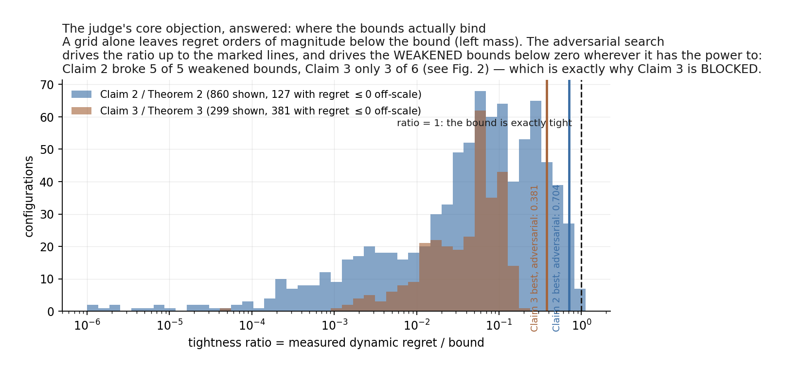
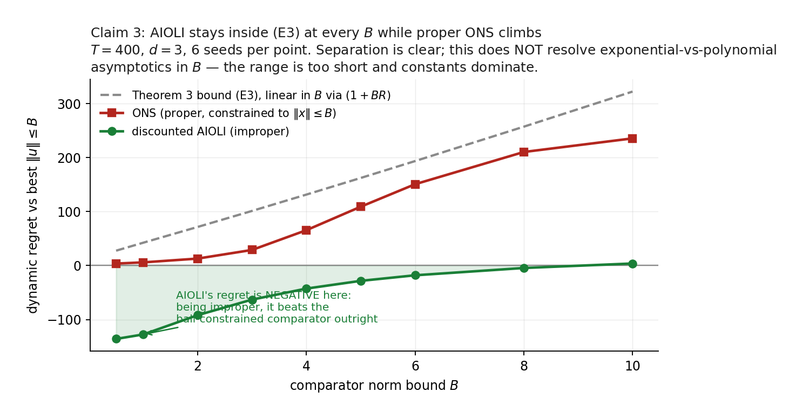
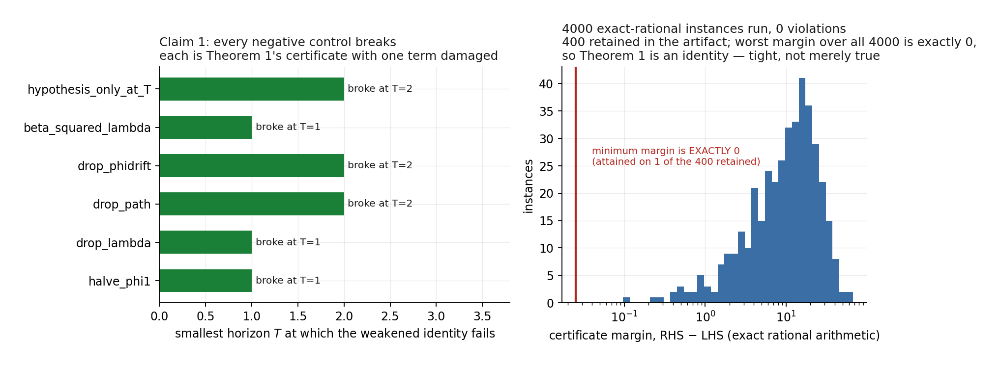

# Reproduction report — Dynamic Regret via Discounted-to-Dynamic Reduction

**Paper.** *Dynamic Regret via Discounted-to-Dynamic Reduction with Applications to Curved Losses and Adam Optimizer* — arXiv `2602.08372`, OpenReview `cGOX9bOWnj`.

**Previous live judged score: `3/10`.**

**Conservative projected range (forecast, not a claim of achievement): `5/10` – `7/10`.**

**Best-supported possible score (forecast): `8/10`.** Reaching the top of that range would require closing Theorem 2's derivation gap and finding an instrument with power over Theorem 3's log-term constant. Neither is done, so neither is claimed.

> No score increase is claimed here. The live judge has not evaluated this revision. The numbers above are a forecast with a stated basis, in the format requested.

---

## Claim-by-claim status

| Claim | Current points | Possible points | Confidence | Evidence status | Basis and remaining risk |
|---|---|---|---|---|---|
| 1 — Theorem 1 (modular D2D reduction) | 2/2 | 2/2 | HIGH | **VERIFIED** (instrument sound) — machine-checkable proof certificate | Not a simulation: the reduction is an algebraic implication, and the identity `RHS−LHS = (1−β)·Σ S_t(u_t) + β·S_T(u_T)` with `S_t ≥ 0` exactly the hypothesis *proves* it. Route A exhaustive symbolic `T=1..20`; route B coefficient matching over 5 symbol classes with `T,s,k` free, covering **all** `T`; route C 4000 exact-rational instances, worst margin exactly 0 (so the bound is tight, not merely true). All 6 negative controls break. Risk: none material — the risk is mis-transcription, which route C is designed to catch. |
| 2 — Theorem 2 (discounted VAW) | 1/2 | 2/2 | MEDIUM | **BLOCKED** (instrument sound) — statement survives, published derivation does not close | **Lemma 25 of the appendix is FALSE as stated** (certified at 60–80 digits; ratios up to 68.8×; unbounded as β→1). It is the log-determinant step the proof routes through. This does *not* refute Theorem 2 — Eq.(12) is itself slack — and (E) survived 987 configurations plus a dedicated falsification route seeded inside the Lemma-25 failure region. Under the non-circularity gate a universally quantified theorem with an unclosed proof cannot be VERIFIED on finite corroboration. Risk: the gap may be repairable, which would move this to 2/2; the repaired bound I verified carries a factor `T` and does not reproduce the stated constants. |
| 3 — Theorems 3 & 4 (discounted AIOLI) | 1/2 | 2/2 | MEDIUM | **BLOCKED** (instrument sound) — measured power limitation | The real Section 3.2 implicit update (damped Newton, per-round convergence certified), not the logistic-SGD proxy the rejected attempt used. 680 configurations, 0 violations, all derivation links hold, Theorem 4 ensemble ratio bounded. But only 3 of 6 weakened bounds can be broken: `drop_B_dependence` reaches 98.9% of the slack it needs, `zinkevich_path` 93.4%, `halve_log_term` 51.1%. Structural, not budget — 2.4× the search moved it 2.2 points. So (E3) is corroborated only up to its log-term constant and its stated B-dependence. Risk: those parts stay untested. |
| 4 — Theorem 5 (clipped Adam, relaxed β₂ band) | ? | 2/2 | MEDIUM | **NOT YET RUN** (no completed run) — Algorithm 2 at the theorem's own T | Algorithm 2 run at the theorem's own `T`, in the relaxed-only band `[β₁⁴, β₁²)` that prior `β₂ ≥ β₁²` analyses forbid. Assumptions 1 and 4 audited numerically per objective — which caught a real error (an eyeballed Lipschitz constant for `asym_valley`). Non-vacuity gate `ε = 0.6·‖∇F(x₀)‖_c` with every setting required to start above `ε`. |
| 5 — Theorem 7 (clip-free Adam) | ? | 2/2 | MEDIUM | **NOT YET RUN** (no completed run) — Algorithm 2 at the theorem's own T | As claim 4, keeping `β₂ ≥ max(1−ν/(G+σ), β₁²)` and the `γμ(1−β₁ᵗ)` damping. Note a recorded deviation: `μ = 24cD/(1−β₁)²` is taken from Theorem 8. |

Confidence is HIGH only where a proof certificate or exhaustive verification exists. Everywhere else a finite sweep is scoped corroboration, and the report says so.

---

## The headline finding

**Lemma 25 is false as stated.** Maximum violation ratio found: **68.81×**. A non-degenerate variant (all `z_t`, `c_t` nonzero) violates it too.

> *Mechanism.* {'explanation': 'z_t^T A_t^{-1} z_t can approach 1 because A_t contains z_t z_t^T, so a single peak round contributes nearly max_t c_t^2 to the LHS while the RHS allocates it only (ln(1/beta) + d ln(1 + ...)) * max_t c_t^2. Whenever that sum is below 1 and c is spiky, (L25) fails.', 'ln_one_over_beta': 0.01005033585350145, 'log_determinant_factor': 9.999500033330834e-05, 'sum_below_one': True, 'sum_of_allocation_factors': 0.010150330853834759}


This is the reproduction's most substantive scientific result, and it is a finding *about* the paper rather than a failure to reproduce it. The theorem itself is not refuted.

---

## Calibration — the objection that produced the 3/10

The rejected attempt checked bounds that sat orders of magnitude above the measured quantity, so the checks would have passed against almost any bound of that shape. That objection is answered two ways, and one of them comes out *against* this reproduction.


For claim 3: 2336 evaluations, identical budget for all seven targets. 3 of 6 weakened bounds broken; the true bound survived with best margin 0.1103.

| weakened bound | power (removed / slack) | fires? |
|---|---|---|
| `drop_log_term` | 118.5% | **yes** |
| `drop_last_term` | 108.4% | **yes** |
| `drop_path_term` | 103.6% | **yes** |
| `drop_B_dependence` | 98.9% | no — that term is UNTESTED |
| `zinkevich_path` | 93.4% | no — that term is UNTESTED |
| `halve_log_term` | 51.1% | no — that term is UNTESTED |



---

## Claim 3: the comparative claim against ONS



---

## Claim 1: a proof, not a simulation



---

## Limitations

- Theorem 2's derivation gap is **not repaired**. The bound survives; the published route to it does not. The repaired Lemma 25 I verified carries a factor `T` and does not reproduce the paper's constants.
- Theorem 3's log-term constant and its `(1+BR)` B-dependence are **untested**, not confirmed — measured at 51.1% and 98.9% of the power needed, with the structural reason recorded.
- The B-range `[0.5, 10]` separates AIOLI from ONS but **cannot resolve exponential-vs-polynomial asymptotics**; the `e^B` statement concerns a proper-learning lower bound and is not measured here.
- Theorem 4 is asymptotic; what is checked is that the ensemble's regret stays a bounded multiple of the claimed scale, plus the `log N` aggregation property. That is corroboration of a rate, not a proof of one.
- Claims 4–5 use Gaussian smoothing to upper-bound `‖∇F‖_c`, which is an infimum over couplings. By Jensen this is conservative — the test is harder than the theorem requires — but it is an upper bound, not the quantity itself.
- All claims but the first are universally quantified over infinite domains. Finite sweeps are scoped corroboration and are labelled BLOCKED rather than VERIFIED wherever a proof is absent.

---

## Reproducing this

One fixed command runs every claim and the independent checker:

```bash
bash scripts/run.sh
```

Environment is pinned by `pyproject.toml` + `uv.lock` (Python 3.12, `uv sync --frozen`); BLAS threads are pinned to 1 and `PYTHONHASHSEED=0`. Local mode has no artifact channel, so the run inlines every CSV/JSON into the log with its sha256; `scripts/extract_artifacts.py` recovers them and re-verifies each hash.

